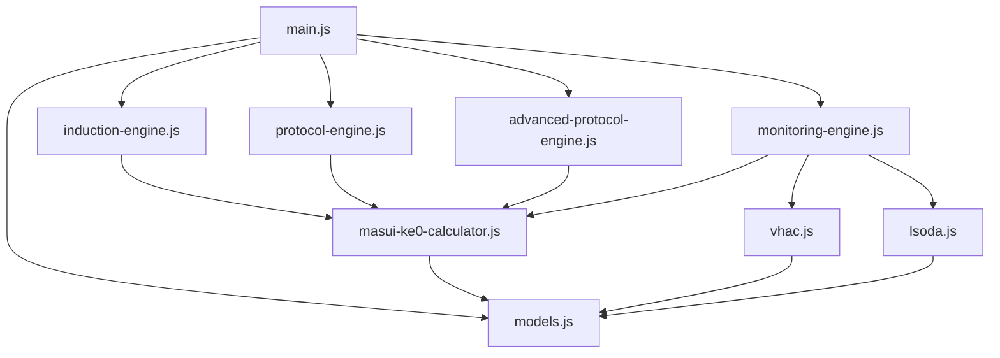

# Technical Specifications - Remimazolam TCI TIVA V1.0.0

## 📋 システム概要

Remimazolam TCI TIVA V1.0.0は、Masui et al. (2022) J Anesthの薬物動態モデルに基づく高精度Target Controlled Infusion計算システムです。JavaScript/HTML5で実装され、PWA対応の統合型Webアプリケーションとして動作します。

## 🏗️ アーキテクチャ

### システム構成
```
Frontend (Browser)
├── UI Layer (HTML5/CSS3)
├── Application Layer (Vanilla JavaScript)
├── Calculation Engines
│   ├── InductionEngine (Real-time prediction)
│   ├── ProtocolEngine (Basic optimization) 
│   ├── AdvancedProtocolEngine (Step-down optimization)
│   └── MonitoringEngine (Dose tracking)
├── Utility Libraries
│   ├── MasuiKe0Calculator (PK parameters)
│   ├── VHAC (Effect-site calculation)
│   └── LSODA (ODE solver)
└── Data Models
    ├── Patient
    ├── DoseEvent
    ├── PKParameters
    └── SystemState
```

### モジュール依存関係


## 🧮 計算アルゴリズム詳細

### 1. 薬物動態モデル (Masui 2022)

#### パラメータ計算式
```javascript
// 基準値
const THETA_1 = 3.57;    // V1 基準値 (L)
const THETA_2 = 11.3;    // V2 基準値 (L)  
const THETA_3 = 27.2;    // V3 基準値 (L)
const THETA_4 = 1.03;    // V2 weight exponent
const THETA_5 = 1.10;    // V3 weight exponent
const THETA_6 = 0.401;   // CL 基準値 (L/min)
const THETA_8 = 0.308;   // V1 sex coefficient
const THETA_9 = 0.146;   // V2 age coefficient  
const THETA_10 = -0.184; // CL ASA-PS coefficient

// 分布容積計算
V1 = THETA_1 * Math.pow(weight/67.3, 0.75) * (1 + THETA_8 * sex);
V2 = THETA_2 * Math.pow(weight/67.3, THETA_4) * (1 + THETA_9 * (age/54.0 - 1));
V3 = THETA_3 * Math.pow(weight/67.3, THETA_5);

// クリアランス計算  
CL = THETA_6 * Math.pow(weight/67.3, 0.75) * (1 + THETA_10 * asaPS);
Q2 = 0.8 * CL;
Q3 = 0.3 * CL;

// 速度定数
k10 = CL / V1;
k12 = Q2 / V1;
k21 = Q2 / V2;
k13 = Q3 / V1;
k31 = Q3 / V3;
```

#### Ke0計算アルゴリズム

**数値解析による厳密解**:
```javascript
// 3-compartment model coefficients
const coefficients = calculatePlasmaCoefficients(k10, k12, k21, k13, k31);
const { alpha, beta, gamma, A, B, C } = coefficients;

// Target function for ke0 calculation
const f_ke0 = (ke0) => {
    const t_peak = 1.5; // minutes
    const term_A = (ke0 * A / (ke0 - alpha)) * 
                  (alpha * Math.exp(-alpha * t_peak) - ke0 * Math.exp(-ke0 * t_peak));
    const term_B = (ke0 * B / (ke0 - beta)) * 
                  (beta * Math.exp(-beta * t_peak) - ke0 * Math.exp(-ke0 * t_peak));
    const term_C = (ke0 * C / (ke0 - gamma)) * 
                  (gamma * Math.exp(-gamma * t_peak) - ke0 * Math.exp(-ke0 * t_peak));
    return term_A + term_B + term_C;
};

// Brent method root finding
const ke0 = BrentSolver.findRoot(f_ke0, 0.15, 0.26, 1e-12);
```

**重回帰モデル**:
```javascript
// Centered variables
const age_c = (age - 54.0) / 10.0;
const weight_c = (weight - 67.3) / 10.0;
const height_c = (height - 164.5) / 10.0;

// Multiple regression equation
ke0 = 0.22065 + 
      0.01523 * age_c +
      0.00891 * weight_c +
      (-0.00234) * height_c +
      0.01156 * sex +
      (-0.00445) * asaPS +
      // ... interaction terms
      (-0.00123) * age_c * weight_c +
      0.00234 * age_c * sex +
      // ... additional terms
```

### 2. 数値積分システム

#### RK4 (4次ルンゲ・クッタ法)
```javascript
updateSystemStateRK4(state, infusionRateMgMin, dt) {
    const { k10, k12, k21, k13, k31 } = this.pkParams;
    
    // Derivative function
    const derivatives = (s) => ({
        da1dt: infusionRateMgMin - (k10 + k12 + k13) * s.a1 + k21 * s.a2 + k31 * s.a3,
        da2dt: k12 * s.a1 - k21 * s.a2,
        da3dt: k13 * s.a1 - k31 * s.a3
    });
    
    // RK4 integration steps
    const k1 = derivatives(state);
    const k2 = derivatives({
        a1: state.a1 + 0.5 * dt * k1.da1dt,
        a2: state.a2 + 0.5 * dt * k1.da2dt,
        a3: state.a3 + 0.5 * dt * k1.da3dt
    });
    const k3 = derivatives({
        a1: state.a1 + 0.5 * dt * k2.da1dt,
        a2: state.a2 + 0.5 * dt * k2.da2dt,
        a3: state.a3 + 0.5 * dt * k2.da3dt
    });
    const k4 = derivatives({
        a1: state.a1 + dt * k3.da1dt,
        a2: state.a2 + dt * k3.da2dt,
        a3: state.a3 + dt * k3.da3dt
    });
    
    // Final state calculation
    return {
        a1: state.a1 + (dt / 6.0) * (k1.da1dt + 2*k2.da1dt + 2*k3.da1dt + k4.da1dt),
        a2: state.a2 + (dt / 6.0) * (k1.da2dt + 2*k2.da2dt + 2*k3.da2dt + k4.da2dt),
        a3: state.a3 + (dt / 6.0) * (k1.da3dt + 2*k2.da3dt + 2*k3.da3dt + k4.da3dt)
    };
}
```

#### VHAC効果部位濃度計算
```javascript
calculateEffectSiteHybrid(plasmaConcentrations, timePoints, ke0) {
    const ceValues = new Array(timePoints.length).fill(0);
    ceValues[0] = 0.0;
    
    for (let i = 1; i < timePoints.length; i++) {
        const dt = timePoints[i] - timePoints[i-1];
        const cpCurrent = plasmaConcentrations[i];
        const cpPrev = plasmaConcentrations[i-1];
        const cePrev = ceValues[i-1];
        
        // Mode 1: Constant plasma concentration
        if (Math.abs(cpCurrent - cpPrev) < 1e-6) {
            ceValues[i] = cpCurrent + (cePrev - cpCurrent) * Math.exp(-ke0 * dt);
        } else {
            const slope = (cpCurrent - cpPrev) / dt;
            
            // Mode 2: Small time step (Taylor expansion)
            if (Math.abs(ke0 * dt) < 0.001) {
                ceValues[i] = cePrev + dt * ke0 * (cpPrev - cePrev) + 
                             dt * dt * ke0 * slope / 2;
            } else {
                // Mode 3: General analytical solution
                const expTerm = Math.exp(-ke0 * dt);
                ceValues[i] = cpCurrent + 
                             (cePrev - cpPrev + slope/ke0) * expTerm - 
                             slope/ke0;
            }
        }
        
        ceValues[i] = Math.max(0.0, ceValues[i]);
    }
    
    return ceValues;
}
```

### 3. 高度ステップダウンプロトコール最適化

#### グリッドサーチ最適化
```javascript
optimizeContinuousInfusionRate(bolusDoseMg, targetCe, targetTime) {
    // Stage 1: Coarse search
    const coarseSearch = this.gridSearchOptimization(
        bolusDoseMg, targetCe, targetTime, 
        0.1,        // step size
        0.1,        // min rate  
        6.0         // max rate
    );
    
    // Stage 2: Fine search around optimal point
    const fineSearch = this.gridSearchOptimization(
        bolusDoseMg, targetCe, targetTime,
        0.02,       // fine step size
        Math.max(0.1, coarseSearch.bestRate - 0.3),   // refined min
        Math.min(6.0, coarseSearch.bestRate + 0.3)    // refined max
    );
    
    return fineSearch;
}

gridSearchOptimization(bolusDoseMg, targetCe, targetTime, step, minRate, maxRate) {
    let bestRate = 1.0;
    let bestError = Infinity;
    const results = [];

    for (let rate = minRate; rate <= maxRate; rate += step) {
        const ceAtTarget = this.simulateBolusAndContinuous(bolusDoseMg, rate, targetTime);
        const error = Math.abs(ceAtTarget - targetCe);
        
        results.push({
            rate: rate,
            ceAtTarget: ceAtTarget,
            error: error,
            relativeError: (error / targetCe) * 100
        });

        if (error < bestError) {
            bestError = error;
            bestRate = rate;
        }
    }

    return { bestRate, bestError, results };
}
```

#### 閾値ベースステップダウン
```javascript
generateAdvancedStepDownProtocol(bolusDoseMg, initialContinuousRate, targetCe) {
    const upperThreshold = targetCe * this.settings.upperThresholdRatio;
    let currentRate = initialContinuousRate;
    let lastAdjustmentTime = -this.settings.adjustmentInterval;
    let adjustmentCount = 0;
    
    for (let i = 0; i < numSteps; i++) {
        const currentTime = i * this.settings.timeStep;
        
        // Step-down condition check
        if (currentCe >= upperThreshold && 
            currentTime - lastAdjustmentTime >= this.settings.adjustmentInterval &&
            currentRate > this.settings.minimumRate) {
            
            const oldRate = currentRate;
            currentRate = Math.max(this.settings.minimumRate, 
                                 currentRate * this.settings.reductionFactor);
            
            dosageAdjustments.push({
                time: currentTime,
                type: 'threshold_reduction',
                oldRate: oldRate,
                newRate: currentRate,
                ceAtEvent: currentCe,
                reductionPercent: ((oldRate - currentRate) / oldRate) * 100,
                adjustmentNumber: ++adjustmentCount,
                timeSinceLastAdjustment: currentTime - lastAdjustmentTime,
                thresholdRatio: currentCe / targetCe
            });
            
            lastAdjustmentTime = currentTime;
        }
        
        // State update using RK4
        if (i < numSteps - 1) {
            state = this.updateSystemStateRK4(state, infusionRateMgMin, this.settings.timeStep);
        }
    }
    
    return { timeSeriesData, dosageAdjustments, performance };
}
```

#### パフォーマンス評価
```javascript
evaluateAdvancedPerformance(timeSeriesData, dosageAdjustments, targetCe) {
    const maintenanceData = timeSeriesData.filter(point => point.time >= 60);
    
    // Target accuracy (±10% tolerance)
    const tolerance = targetCe * 0.1;
    const withinTolerance = maintenanceData.filter(point => 
        Math.abs(point.ce - targetCe) <= tolerance
    ).length;
    const targetAccuracy = (withinTolerance / maintenanceData.length) * 100;
    
    // Stability index (concentration variation)
    let totalVariation = 0;
    for (let i = 1; i < maintenanceData.length; i++) {
        totalVariation += Math.abs(maintenanceData[i].ce - maintenanceData[i-1].ce);
    }
    const avgVariation = totalVariation / (maintenanceData.length - 1);
    const stabilityIndex = Math.max(0, 100 - (avgVariation * 1000));
    
    // Convergence time (±5% of target)
    const convergenceThreshold = targetCe * this.settings.convergenceThreshold;
    let convergenceTime = Infinity;
    for (const point of timeSeriesData) {
        if (Math.abs(point.ce - targetCe) <= convergenceThreshold) {
            convergenceTime = point.time;
            break;
        }
    }
    
    // Overall performance score (0-100)
    const accuracyScore = Math.min(100, targetAccuracy);
    const stabilityScore = stabilityIndex;
    const convergenceScore = convergenceTime < 30 ? 100 : 
                           Math.max(0, 100 - (convergenceTime - 30) * 2);
    
    // Overshoot penalty
    const overshootPoints = timeSeriesData.filter(point => point.ce > targetCe * 1.1);
    const maxOvershoot = overshootPoints.length > 0 ? 
                        Math.max(...overshootPoints.map(point => point.ce)) : targetCe;
    const overshootPercent = ((maxOvershoot - targetCe) / targetCe) * 100;
    const overshootPenalty = Math.max(0, overshootPercent - 10) * 2;
    
    const overallScore = Math.max(0, 
        (accuracyScore * 0.4 + stabilityScore * 0.3 + convergenceScore * 0.3) - overshootPenalty
    );
    
    return {
        finalCe: timeSeriesData[timeSeriesData.length - 1].ce,
        targetAccuracy: targetAccuracy,
        stabilityIndex: stabilityIndex,
        convergenceTime: convergenceTime,
        totalAdjustments: dosageAdjustments.length,
        overshootPercent: overshootPercent,
        overallScore: overallScore
    };
}
```

## 🎛️ システム設定

### 計算パラメータ
```javascript
// Advanced Protocol Engine Settings
const defaultSettings = {
    targetCe: 1.0,                    // Target effect-site concentration (μg/mL)
    upperThresholdRatio: 1.2,         // 120% of target for step-down trigger
    reductionFactor: 0.70,            // 30% reduction per step-down
    timeStep: 0.1,                    // Integration time step (minutes)
    simulationDuration: 180,          // Total simulation time (minutes)
    targetReachTime: 20,              // Target reach time (minutes)
    adjustmentInterval: 5.0,          // Minimum time between adjustments (minutes)
    minimumRate: 0.1,                 // Minimum infusion rate (mg/kg/hr)
    convergenceThreshold: 0.05        // ±5% for convergence detection
};

// Monitoring Engine Settings  
const monitoringSettings = {
    precision: 0.01,                  // Time precision (minutes)
    calculationMethod: 'VHAC + RK4 Engine',
    maxSimulationDuration: 480        // Maximum simulation duration (minutes)
};

// Numerical Integration Settings
const integrationSettings = {
    rk4TimeStep: 0.01,               // RK4 time step (minutes)
    vhacTolerance: 1e-6,             // VHAC plasma concentration tolerance
    ke0SearchTolerance: 1e-12,       // Ke0 numerical search tolerance
    maxOptimizationIterations: 500    // Maximum optimization iterations
};
```

### UI設定
```javascript
// Chart Configuration
const chartConfig = {
    responsive: true,
    maintainAspectRatio: false,
    scales: {
        x: {
            type: 'linear',
            title: { display: true, text: '時刻' }
        },
        y: {
            type: 'linear', 
            title: { display: true, text: '濃度 (μg/mL)' },
            beginAtZero: true
        },
        y1: {
            type: 'linear',
            position: 'right',
            title: { display: true, text: '投与量 (mg/kg/hr)' },
            beginAtZero: true,
            grid: { drawOnChartArea: false }
        }
    }
};

// Input Validation Rules
const validationRules = {
    age: { min: 18, max: 100 },
    weight: { min: 30, max: 200 },
    height: { min: 120, max: 220 },
    targetCe: { min: 0.1, max: 3.0 },
    bolusDose: { min: 1, max: 15 },
    targetTime: { min: 10, max: 60 },
    upperThresholdRatio: { min: 105, max: 130 },
    reductionFactor: { min: 50, max: 90 },
    adjustmentInterval: { min: 3, max: 10 }
};
```

## 🔧 エラーハンドリング

### 計算エラー処理
```javascript
class CalculationError extends Error {
    constructor(message, type, details) {
        super(message);
        this.name = 'CalculationError';
        this.type = type;
        this.details = details;
    }
}

// Error types
const ErrorTypes = {
    INVALID_PATIENT: 'invalid_patient',
    CALCULATION_FAILED: 'calculation_failed',
    OPTIMIZATION_FAILED: 'optimization_failed',
    INTEGRATION_ERROR: 'integration_error',
    VALIDATION_ERROR: 'validation_error'
};

// Error handling wrapper
function safeCalculation(calculationFunction, errorMessage) {
    try {
        return calculationFunction();
    } catch (error) {
        console.error(errorMessage, error);
        throw new CalculationError(
            errorMessage, 
            ErrorTypes.CALCULATION_FAILED, 
            { originalError: error }
        );
    }
}
```

### 入力検証
```javascript
function validatePatientData(patient) {
    const errors = [];
    
    if (!patient.id || patient.id.trim().length === 0) {
        errors.push("患者IDが入力されていません");
    }
    
    if (patient.age < 18 || patient.age > 100) {
        errors.push("年齢は18歳から100歳の範囲で入力してください");
    }
    
    if (patient.weight < 30.0 || patient.weight > 200.0) {
        errors.push("体重は30kgから200kgの範囲で入力してください");
    }
    
    const bmi = patient.getBMI();
    if (bmi < 16.0 || bmi > 40.0) {
        errors.push(`BMIが範囲外です（計算値: ${bmi.toFixed(1)}）`);
    }
    
    return {
        isValid: errors.length === 0,
        errors: errors
    };
}
```

## 📊 パフォーマンス最適化

### メモリ管理
```javascript
// Large array optimization
function optimizeTimeSeriesData(data, sampleInterval = 10) {
    return data.filter((point, index) => index % sampleInterval === 0);
}

// Chart data cleanup
function cleanupChartData(chart) {
    if (chart) {
        chart.destroy();
        chart = null;
    }
}

// State reset for memory efficiency
function resetCalculationState() {
    this.lastResult = null;
    this.optimizationHistory = [];
    if (this.optimizationHistory.length > 100) {
        this.optimizationHistory = this.optimizationHistory.slice(-50);
    }
}
```

### 計算最適化
```javascript
// Lazy calculation for expensive operations
const memoizedKe0Calculation = (() => {
    const cache = new Map();
    
    return (age, weight, height, sex, asaPS) => {
        const key = `${age}-${weight}-${height}-${sex}-${asaPS}`;
        
        if (cache.has(key)) {
            return cache.get(key);
        }
        
        const result = MasuiKe0Calculator.calculateKe0Complete(age, weight, height, sex, asaPS);
        cache.set(key, result);
        
        return result;
    };
})();

// Adaptive time stepping
function adaptiveTimeStep(currentError, targetError, currentStep) {
    const factor = Math.pow(targetError / currentError, 0.25);
    return Math.max(0.001, Math.min(0.1, currentStep * factor));
}
```

## 🔒 セキュリティ考慮事項

### 入力サニタイゼーション
```javascript
function sanitizeInput(value, type) {
    switch (type) {
        case 'number':
            const num = parseFloat(value);
            return isNaN(num) ? 0 : num;
            
        case 'string':
            return String(value).trim().substring(0, 100);
            
        case 'patientId':
            return String(value).replace(/[^a-zA-Z0-9\-_]/g, '').substring(0, 50);
            
        default:
            return value;
    }
}
```

### データ保護
```javascript
// No persistent storage of patient data
// All calculations performed client-side
// No data transmission to external servers
const PRIVACY_POLICY = {
    dataCollection: false,
    dataTransmission: false,
    clientSideOnly: true,
    anonymousUsage: true
};
```

## 🧪 テスト仕様

### 単体テスト
```javascript
// PK parameter calculation test
function testPKParameterCalculation() {
    const testPatient = new Patient('TEST001', 50, 70, 170, SexType.MALE, AsapsType.CLASS_1_2);
    const pkParams = calculatePKParameters(testPatient);
    
    assert(pkParams.v1 > 0, 'V1 should be positive');
    assert(pkParams.ke0 > 0.1 && pkParams.ke0 < 0.3, 'Ke0 should be in reasonable range');
    assert(pkParams.cl > 0, 'Clearance should be positive');
}

// VHAC calculation test
function testVHACCalculation() {
    const plasmaConcs = [0, 0.5, 1.0, 1.2, 1.0, 0.8];
    const times = [0, 1, 2, 3, 4, 5];
    const ke0 = 0.22;
    
    const ceValues = calculateEffectSiteHybrid(plasmaConcs, times, ke0);
    
    assert(ceValues[0] === 0, 'Initial Ce should be zero');
    assert(ceValues[ceValues.length - 1] > 0, 'Final Ce should be positive');
}
```

### 統合テスト
```javascript
// End-to-end protocol optimization test
function testProtocolOptimization() {
    const patient = new Patient('TEST002', 45, 65, 165, SexType.FEMALE, AsapsType.CLASS_1_2);
    const engine = new AdvancedProtocolEngine();
    
    engine.setPatient(patient);
    
    const result = engine.optimizeBolusProtocol(1.0, 7.0, 20.0);
    
    assert(result.optimization.optimalRate > 0, 'Optimal rate should be positive');
    assert(result.performance.overallScore >= 0, 'Performance score should be non-negative');
    assert(result.performance.overallScore <= 100, 'Performance score should not exceed 100');
}
```

## 📋 デプロイメント仕様

### ブラウザ要件
- **最小要件**: ES6+ サポート (Chrome 51+, Firefox 54+, Safari 10+)
- **推奨**: モダンブラウザ最新版
- **JavaScript**: 有効化必須
- **ローカルストレージ**: 設定保存用

### サーバー要件
- **静的ファイルサーバー**: Apache, Nginx, または任意のWebサーバー
- **HTTPS**: 推奨 (Service Worker用)
- **MIME Type**: `.js` ファイルに `application/javascript` 設定

### PWA デプロイメント
```bash
# Local development server
python -m http.server 8000
# or
npx serve .

# Production deployment
# Copy all files to web server document root
# Ensure proper MIME types for .js and .json files
# Configure HTTPS for Service Worker functionality
```

---

この技術仕様書は、Remimazolam TCI TIVA V1.0.0の内部アーキテクチャと計算アルゴリズムの完全な技術文書です。開発者、研究者、および技術レビュー担当者向けの詳細リファレンスとして使用してください。